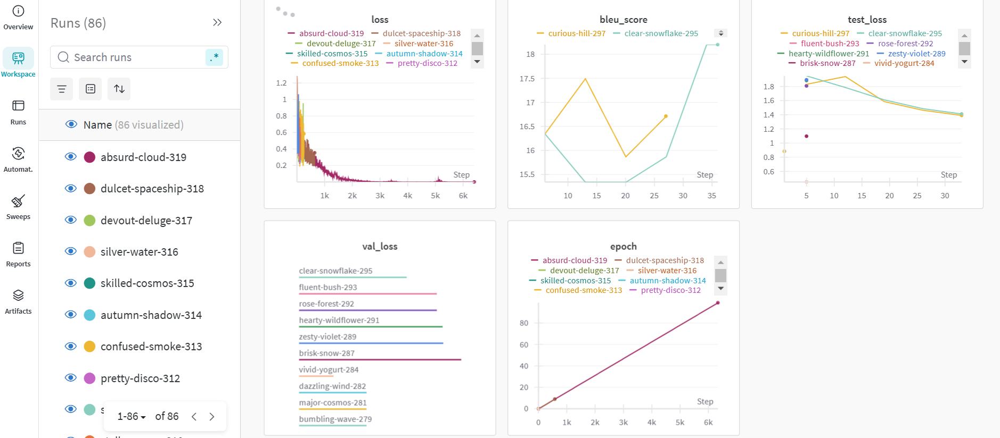
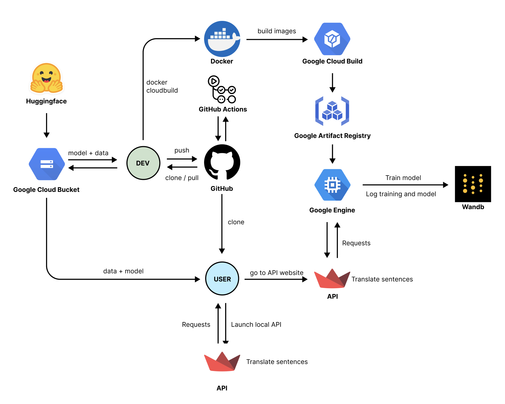

# Exam template for 02476 Machine Learning Operations

This is the report template for the exam. Please only remove the text formatted as with three dashes in front and behind
like:

```--- question 1 fill here ---```

Where you instead should add your answers. Any other changes may have unwanted consequences when your report is
auto-generated at the end of the course. For questions where you are asked to include images, start by adding the image
to the `figures` subfolder (please only use `.png`, `.jpg` or `.jpeg`) and then add the following code in your answer:

```markdown

```

In addition to this markdown file, we also provide the `report.py` script that provides two utility functions:

Running:

```bash
python report.py html
```

Will generate a `.html` page of your report. After the deadline for answering this template, we will auto-scrape
everything in this `reports` folder and then use this utility to generate a `.html` page that will be your serve
as your final hand-in.

Running

```bash
python report.py check
```

Will check your answers in this template against the constraints listed for each question e.g. is your answer too
short, too long, or have you included an image when asked. For both functions to work you mustn't rename anything.
The script has two dependencies that can be installed with

```bash
pip install typer markdown
```

## Overall project checklist

The checklist is *exhaustive* which means that it includes everything that you could do on the project included in the
curriculum in this course. Therefore, we do not expect at all that you have checked all boxes at the end of the project.
The parenthesis at the end indicates what module the bullet point is related to. Please be honest in your answers, we
will check the repositories and the code to verify your answers.

### Week 1

* [X] Create a git repository (M5)
* [X] Make sure that all team members have write access to the GitHub repository (M5)
* [X] Create a dedicated environment for you project to keep track of your packages (M2)
* [X] Create the initial file structure using cookiecutter with an appropriate template (M6)
* [X] Fill out the `data.py` file such that it downloads whatever data you need and preprocesses it (if necessary) (M6)
* [X] Add a model to `model.py` and a training procedure to `train.py` and get that running (M6)
* [X] Remember to fill out the `requirements.txt` and `requirements_dev.txt` file with whatever dependencies that you
    are using (M2+M6)
* [X] Remember to comply with good coding practices (`pep8`) while doing the project (M7)
* [X] Do a bit of code typing and remember to document essential parts of your code (M7)
* [ ] Setup version control for your data or part of your data (M8)
* [X] Add command line interfaces and project commands to your code where it makes sense (M9)
* [X] Construct one or multiple docker files for your code (M10)
* [X] Build the docker files locally and make sure they work as intended (M10)
* [X] Write one or multiple configurations files for your experiments (M11)
* [ ] Used Hydra to load the configurations and manage your hyperparameters (M11)
* [ ] Use profiling to optimize your code (M12)
* [X] Use logging to log important events in your code (M14)
* [X] Use Weights & Biases to log training progress and other important metrics/artifacts in your code (M14)
* [ ] Consider running a hyperparameter optimization sweep (M14)
* [ ] Use PyTorch-lightning (if applicable) to reduce the amount of boilerplate in your code (M15)

### Week 2

* [X] Write unit tests related to the data part of your code (M16)
* [X] Write unit tests related to model construction and or model training (M16)
* [X] Calculate the code coverage (M16)
* [X] Get some continuous integration running on the GitHub repository (M17)
* [X] Add caching and multi-os/python/pytorch testing to your continuous integration (M17)
* [X] Add a linting step to your continuous integration (M17)
* [X] Add pre-commit hooks to your version control setup (M18)
* [ ] Add a continues workflow that triggers when data changes (M19)
* [ ] Add a continues workflow that triggers when changes to the model registry is made (M19)
* [X] Create a data storage in GCP Bucket for your data and link this with your data version control setup (M21)
* [X] Create a trigger workflow for automatically building your docker images (M21)
* [X] Get your model training in GCP using either the Engine or Vertex AI (M21)
* [ ] Create a FastAPI application that can do inference using your model (M22)
* [ ] Deploy your model in GCP using either Functions or Run as the backend (M23)
* [ ] Write API tests for your application and setup continues integration for these (M24)
* [ ] Load test your application (M24)
* [ ] Create a more specialized ML-deployment API using either ONNX or BentoML, or both (M25)
* [ ] Create a frontend for your API (M26)

### Week 3

* [ ] Check how robust your model is towards data drifting (M27)
* [ ] Deploy to the cloud a drift detection API (M27)
* [ ] Instrument your API with a couple of system metrics (M28)
* [ ] Setup cloud monitoring of your instrumented application (M28)
* [ ] Create one or more alert systems in GCP to alert you if your app is not behaving correctly (M28)
* [ ] If applicable, optimize the performance of your data loading using distributed data loading (M29)
* [ ] If applicable, optimize the performance of your training pipeline by using distributed training (M30)
* [ ] Play around with quantization, compilation and pruning for you trained models to increase inference speed (M31)

### Extra

* [ ] Write some documentation for your application (M32)
* [ ] Publish the documentation to GitHub Pages (M32)
* [ ] Revisit your initial project description. Did the project turn out as you wanted?
* [ ] Create an architectural diagram over your MLOps pipeline
* [ ] Make sure all group members have an understanding about all parts of the project
* [ ] Uploaded all your code to GitHub

## Group information

### Question 1
> **Enter the group number you signed up on <learn.inside.dtu.dk>**
>
> Answer:

47

### Question 2
> **Enter the study number for each member in the group**
>
> Example:
>
> *sXXXXXX, sXXXXXX, sXXXXXX*
>
> Answer:

s203512, s203520, s203581, s204201

### Question 3
> **A requirement to the project is that you include a third-party package not covered in the course. What framework**
> **did you choose to work with and did it help you complete the project?**
>
> Recommended answer length: 100-200 words.
>
> Example:
> *We used the third-party framework ... in our project. We used functionality ... and functionality ... from the*
> *package to do ... and ... in our project*.
>
> Answer:

We used the third-party framework Transformers from Huggingface to fine-tune the pretrained T5 model for translating from English to Danish. The framework made it easy to access and work with the T5 model, saving us time on setting up and training from scratch. 
We used the T5Tokenizer from Transformers to preprocess the dataset, ensuring that our input data was correctly formatted for the T5 model. Furthermore, we had to address challenges related to token alignment for Danish-specific characters such as "å", "ø", and "æ" . Here we applied custom normalization for Danish-specific characters using the Sequence normalizer from the tokenizers package, which is part of the Transformers library. 


## Coding environment

> In the following section we are interested in learning more about you local development environment. This includes
> how you managed dependencies, the structure of your code and how you managed code quality.

### Question 4

> **Explain how you managed dependencies in your project? Explain the process a new team member would have to go**
> **through to get an exact copy of your environment.**
>
> Recommended answer length: 100-200 words
>
> Example:
> *We used ... for managing our dependencies. The list of dependencies was auto-generated using ... . To get a*
> *complete copy of our development environment, one would have to run the following commands*
>
> Answer:

We used a combination of Conda and pip for managing our project dependencies. To set up an exact copy of our environment, a new team member should clone the repository and cd into it. To initialize an environment based on our requirements, one should run the following:

```bash
conda create -n ml_ops 'python==3.11'
conda activate ml_ops
pip install -e .
```
This will create an environment for for the project, activate it, and install the requirements. 
We log the needed packages to run our project in a requirements.txt file. Furthermore, in this file we state the version of each package in order to ensure reproducibility and robustness of our project. 

### Question 5

> **We expect that you initialized your project using the cookiecutter template. Explain the overall structure of your**
> **code. What did you fill out? Did you deviate from the template in some way?**
>
> Recommended answer length: 100-200 words
>
> Example:
> *From the cookiecutter template we have filled out the ... , ... and ... folder. We have removed the ... folder*
> *because we did not use any ... in our project. We have added an ... folder that contains ... for running our*
> *experiments.*
>
> Answer:

We initialized our project using the given cookiecutter template in this course (https://github.com/SkafteNicki/mlops_template). We've largely followed  this standard for organizing the code in our project. 
We've filled out the data folder(split into raw, which is downloaded from a gcp bucket,and afterwards processed), dockerfiles (containing the dockerfiles used in this project), reports (for the project), src (for relevant python scripts) and tests (for pytests) folders according to the standard. However, we have removed the notebooks folder as the project doesn't involve any. Models are saved in a gcp bucket. Furthermore, doing development of our framework we added a data/test_data folder for a subset of our dataset.

todo: delete unused folders and update this (103 words)

### Question 6

> **Did you implement any rules for code quality and format? What about typing and documentation? Additionally,**
> **explain with your own words why these concepts matters in larger projects.**
>
> Recommended answer length: 100-200 words.
>
> Example:
> *We used ... for linting and ... for formatting. We also used ... for typing and ... for documentation. These*
> *concepts are important in larger projects because ... . For example, typing ...*
>
> Answer:

We implemented several rules for code quality and formatting using tools like Black for consistent formatting, Ruff for linting, and Mypy for static type checking. Pre-commit hooks were used to enforce rules like removing trailing whitespace, ensuring end-of-file newlines, checking YAML syntax, and preventing large file commits. We also made sure to add docstrings and typing to important python functions for documentation.

These concepts are essential in larger projects as they ensure code consistency, prevent errors, and improve maintainability. Automated checks save time, reduce technical debt, and support collaboration by making the codebase easier to understand and scale as the team grows.

## Version control

> In the following section we are interested in how version control was used in your project during development to
> corporate and increase the quality of your code.

### Question 7

> **How many tests did you implement and what are they testing in your code?**
>
> Recommended answer length: 50-100 words.
>
> Example:
> *In total we have implemented X tests. Primarily we are testing ... and ... as these the most critical parts of our*
> *application but also ... .*
>
> Answer:

We've implemented a total of 8 tests using pytest. The tests focus on ensuring that we are splitting and pre-processing (tokenizing) our data correctly. We've created a split function which allows us to control how much of the data we want to use for test/train respectively, and it is crucial that this function works as expected. Furthermore, we test our whether our model is initialized properly, that the configurations are loaded correctly and that the model.py can run without errors when executed. We consider this to be the most vital functionalities of our project.

### Question 8

> **What is the total code coverage (in percentage) of your code? If your code had a code coverage of 100% (or close**
> **to), would you still trust it to be error free? Explain you reasoning.**
>
> Recommended answer length: 100-200 words.
>
> Example:
> *The total code coverage of code is X%, which includes all our source code. We are far from 100% coverage of our **
> *code and even if we were then...*
>
> Answer:

The total code coverage is 42%, meaning that some of our code is tested. We could probably expand some test to include more lines of code, but we can see from the coverage report that the most important feautures are tested. 

Even with a near 100% code coverage it is not certain that the code would be error free. As the code coverage report how many lines of code are run when your tests are executed, it would still be possible to have errors hidden somewhere. But it is a good indicator that the code is thoroughly tested for potential bugs.


### Question 9

> **Did you workflow include using branches and pull requests? If yes, explain how. If not, explain how branches and**
> **pull request can help improve version control.**
>
> Recommended answer length: 100-200 words.
>
> Example:
> *We made use of both branches and PRs in our project. In our group, each member had an branch that they worked on in*
> *addition to the main branch. To merge code we ...*
>
> Answer:

During our project work, we used branches in order to minimize merge conflicts. Instead of each member having their own branch to do their work in, a new branch was created whenever a new feature was needed (an example of a "feature" being creating the train.py file/creating a test/making a function etc.). Furthermore, we used kanban boards (trello.com) to organize and divide our workload, and thereby ensure we weren't working on the same tasks or in the same files at the same time.
Smaller changes (such as filling out our answers to the reports/README.md) were allowed directly on the master branch. 
Inevitably, the resulting merge conflicts were resolved collaboratively between group members on deciding what version to keep.

In general, using branches allow developers to work on seperate features without affecting the main code base. In line with this, pull requests allow for code review and discussion before merging these changes.

### Question 10

> **Did you use DVC for managing data in your project? If yes, then how did it improve your project to have version**
> **control of your data. If no, explain a case where it would be beneficial to have version control of your data.**
>
> Recommended answer length: 100-200 words.
>
> Example:
> *We did make use of DVC in the following way: ... . In the end it helped us in ... for controlling ... part of our*
> *pipeline*
>
> Answer:

We decided not to use DVC for data version control. In general, it is beneficial to include version control of the data used when training a model in order to ensure reproducibility. In this project, we pre-process the data by splitting it into train/test set (at a given percent parameter), and tokenize it. DVC could help us track changes in the dataset or preprocessing steps over time. For example, if we decided to filter the dataset or modify the tokenization parameters, DVC would allow us to version these changes and link them to specific model training results.
This versioning would enable us to rerun experiments with the correct dataset version, thus ensuring reproducibility.

### Question 11

> **Discuss you continuous integration setup. What kind of continuous integration are you running (unittesting,**
> **linting, etc.)? Do you test multiple operating systems, Python  version etc. Do you make use of caching? Feel free**
> **to insert a link to one of your GitHub actions workflow.**
>
> Recommended answer length: 200-300 words.
>
> Example:
> *We have organized our continuous integration into 3 separate files: one for doing ..., one for running ... testing*
> *and one for running ... . In particular for our ..., we used ... .An example of a triggered workflow can be seen*
> *here: <weblink>*
>
> Answer:

We have organized our continuous integration into several YAML files, each focused on a specific aspect of the development process: codecheck, pre_commit, and tests. The continuous integration is implemented using GitHub actions such that tests are automatically executed on code changes.

The codecheck workflow ensures that the code is consistently linted, formatted, and documented. It identifies code style issues and potential errors, aligning with the standards defined in our project. We carefully sequence the execution of the packages to ensure they support and complement each other throughout the process

The pre_commit workflow runs the pre-commit hooks as defined in the pre-commit-config.yaml. This automates tasks such as fixing common formatting issues, checking for unnecessary trailing whitespaces, and verifying other code quality standards before each commit is made.

The tests workflow is set up to run our unit tests and integration tests. We test across multiple operating systems (macOS, Ubuntu, and Windows) to ensure compatibility with different environments. We also specify that Python 3.11 is the version we use, and all testing is done exclusively with this version to maintain consistency. 
Additionally, we use caching during the installation of dependencies by leveraging the pip cache. This helps speed up the installation process by reusing previously downloaded dependencies, significantly reducing CI run times.

## Running code and tracking experiments

> In the following section we are interested in learning more about the experimental setup for running your code and
> especially the reproducibility of your experiments.

### Question 12

> **How did you configure experiments? Did you make use of config files? Explain with coding examples of how you would**
> **run a experiment.**
>
> Recommended answer length: 50-100 words.
>
> Example:
> *We used a simple argparser, that worked in the following way: Python  my_script.py --lr 1e-3 --batch_size 25*
>
> Answer:

We used a Makefile to structure our workflow, simplifying the execution of various tasks like data preparation, testing, and training. Each Makefile target represents a specific step in the workflow. E.g., the train target:

```make
train:
	# Train model
	python  src/ml_ops_project/train.py train
```

We used Typer to parse arguments, thus the above will run the train function in the train.py file.

Regarding configuration, we made use of config files to specify what parameters were used to initialize and train the model.

### Question 13

> **Reproducibility of experiments are important. Related to the last question, how did you secure that no information**
> **is lost when running experiments and that your experiments are reproducible?**
>
> Recommended answer length: 100-200 words.
>
> Example:
> *We made use of config files. Whenever an experiment is run the following happens: ... . To reproduce an experiment*
> *one would have to do ...*
>
> Answer:

As stated above, we made use of config files in our project. For configuration of our model parameters and training parameters, we created model_config.yaml and train_config.yaml files, which contains the specified parameters. The model_config.yaml is used to initialize a T5Config object, and then passed to the T5ForConditionalGeneration model to configure it.
Regarding the training parameters, the parameters are loaded from the train_config.yaml file during the training loop. We integrated Weights & Biases for experiment logging. Thus the training parameters are logged in Weights & Biases. Furthermore, the model is saved as an artefact. Therefore, in order to reproduce an experiment, a team member should use the same version of the config files. 

### Question 14

> **Upload 1 to 3 screenshots that show the experiments that you have done in W&B (or another experiment tracking**
> **service of your choice). This may include loss graphs, logged images, hyperparameter sweeps etc. You can take**
> **inspiration from [this figure](figures/wandb.png). Explain what metrics you are tracking and why they are**
> **important.**
>
> Recommended answer length: 200-300 words + 1 to 3 screenshots.
>
> Example:
> *As seen in the first image when have tracked ... and ... which both inform us about ... in our experiments.*
> *As seen in the second image we are also tracking ... and ...*
>
> Answer:



As seen in the attached screenshot, we primarily focused on tracking loss across our models during training. Loss is a fundamental metric because it directly reflects how well the model predictions align with the ground truth, making it an essential indicator of model performance during the learning process. While we explored the possibility of tracking other metrics, we ultimately decided to log only loss during training to keep our experiments focused.

Although accuracy is a commonly logged metric in many machine learning tasks, we determined it would provide limited insight for our specific application, as our model is designed for translation rather than classification. Accuracy does not capture the subtleties of sequence-based tasks like translation, where partial correctness is significant.

One metric we chose to evaluate only after training was the BLEU Score, which is particularly relevant in natural language processing tasks like machine translation. BLEU measures how well the model-generated text aligns with the reference text, providing valuable insights into translation quality. Its post-training evaluation allowed us to compare models and identify which configurations worked best for our task.

We ultimately did not conduct hyperparameter sweeps, as the focus of our project was on other aspects of the problem rather than optimizing the model extensively. However, had we pursued sweeps, we could have explored different hyperparameters such as learning rate, batch sizes and dropout rate.

### Question 15

> **Docker is an important tool for creating containerized applications. Explain how you used docker in your**
> **experiments/project? Include how you would run your docker images and include a link to one of your docker files.**
>
> Recommended answer length: 100-200 words.
>
> Example:
> *For our project we developed several images: one for training, inference and deployment. For example to run the*
> *training docker image: `docker run trainer:latest lr=1e-3 batch_size=64`. Link to docker file: <weblink>*
>
> Answer:

For our project we mainly realied on a docker image describing how to create a docker container with the correct environment, data and scripts for training our models. This file could be run with: 
`docker run -e  <wandb_api_key> <docker_container>` 
Here we provide the script with the wandb_api_key such that it can connect to our wandb account for logging the various parameters and output of our training loop. A link to the dockerfile can be found at: 
<https://github.com/Las02/ml_ops_project/blob/master/dockerfiles/train.dockerfile>*
This dockerimage was the build using the Google Cloud Build application and stored on the Google Artifact repository. We could then pull the docker container down whenever we wanted to run it to train our model. 


### Question 16

> **When running into bugs while trying to run your experiments, how did you perform debugging? Additionally, did you**
> **try to profile your code or do you think it is already perfect?**
>
> Recommended answer length: 100-200 words.
>
> Example:
> *Debugging method was dependent on group member. Some just used ... and others used ... . We did a single profiling*
> *run of our main code at some point that showed ...*
>
> Answer:

Debugging methods varied among our group members. Some used breakpoints and the built-in debugger function in their IDE (vscode) to step through the code and inspect variable values at different stages. Others preferred print statements to quickly track the flow of execution and identify where the issue might lie. Another group member utilized interactive debugging in Jupyter Notebooks, running code in smaller, isolated cells to more easily identify errors and experiment with potential fixes. 
Although we didn't profile our code, doing so would have been beneficial to identify bottle necks and inefficient code, and thereby optimize runtime and code quality. 


## Working in the cloud

> In the following section we would like to know more about your experience when developing in the cloud.

### Question 17

> **List all the GCP services that you made use of in your project and shortly explain what each service does?**
>
> Recommended answer length: 50-200 words.
>
> Example:
> *We used the following two services: Engine and Bucket. Engine is used for... and Bucket is used for...*
>
> Answer:

We used Compute Engine, Artifact Registry, Bucket and Cloud Build in our project. Compute Engine is used to create and run virtual machines, giving us a separate environment to work with. Artifact Registry is used for building and storing container images. Bucket is for cloud storage. We also used Cloud Build to automate the process of building and deploying containers, which streamlined our workflow. 

### Question 18

> **The backbone of GCP is the Compute engine. Explained how you made use of this service and what type of VMs**
> **you used?**
>
> Recommended answer length: 100-200 words.
>
> Example:
> *We used the compute engine to run our ... . We used instances with the following hardware: ... and we started the*
> *using a custom container: ...*
>
> Answer:

We started off using the compute engine to train our models. Here we started off testing whether our dockerized application (build using cloud build and stored on artifact registry) worked using an E2 instance with the minimum compute specs - but with additional disk storage to make room for the dataset and the large pytorch dependencies. Later when we had figured out how to get our dockerized application to run correctly, we change to a larger VM. Here we swapped to an E2 instance with the "e2-highcpu-16" but we still had pretty slow performance - and our plan was therefore to swap to a VM with GPU support. Unfortunatly, since we did not request GPU access in time we did not were not able to use the VM with GPU support. We therefore choose to train our model on the DTU HPC. Here the model was trained on a Tesla V100-SXM2.

### Question 19

> **Insert 1-2 images of your GCP bucket, such that we can see what data you have stored in it.**
> **You can take inspiration from [this figure](figures/bucket.png).**
>
> Answer:


### Question 20

> **Upload 1-2 images of your GCP artifact registry, such that we can see the different docker images that you have**
> **stored. You can take inspiration from [this figure](figures/registry.png).**
>
> Answer:


### Question 21

> **Upload 1-2 images of your GCP cloud build history, so we can see the history of the images that have been build in**
> **your project. You can take inspiration from [this figure](figures/build.png).**
>
> Answer:


### Question 22

> **Did you manage to train your model in the cloud using either the Engine or Vertex AI? If yes, explain how you did**
> **it. If not, describe why.**
>
> Recommended answer length: 100-200 words.
>
> Example:
> *We managed to train our model in the cloud using the Engine. We did this by ... . The reason we choose the Engine*
> *was because ...*
>
> Answer:

As mentioned earlier we managed to get everything set up to train our model in the cloud using the Google Compute Engine application - although we did not manage to get GPU support working as we did not have time to get propper permissions from Google to use the GPU ressources. To get our model set up using the Google Compute engine, we started off by by first dockerizing our application. Here we included steps to download and tokenize our data. We downloaded our data from OPUS, and stored it in a bucket. To dockerize our data we used the Google Cloud build application, by preparing the cloudbuild.yaml found in our repository. We then open up a VM on the Google Compute Engine and ssh'ed into the VM. Here we set up docker and pulled the dockerized application from the google artifacts registry - and trained the model. But due to the lack of GPU support we did give the model time enough to finish training and instead used theHPC system at dtu for training the model.

## Deployment

### Question 23

> **Did you manage to write an API for your model? If yes, explain how you did it and if you did anything special. If**
> **not, explain how you would do it.**
>
> Recommended answer length: 100-200 words.
>
> Example:
> *We did manage to write an API for our model. We used FastAPI to do this. We did this by ... . We also added ...*
> *to the API to make it more ...*
>
> Answer:

We wrote and API for our model, using FastAPI. We made a simple api containing only one option for POST requests from the root directory. Here the argument is a sentence, the API then passes the sentence to the model and tries to translate the sentence and sends the resulting translated sentance back. To not load our model everytime the API was called we implemented the API such that when created it loads the model. Whenever our API is called in then just calls the in-memory model. To do this we used the `@asynccontextmanager` which were explained in the course.

### Question 24

> **Did you manage to deploy your API, either in locally or cloud? If not, describe why. If yes, describe how and**
> **preferably how you invoke your deployed service?**
>
> Recommended answer length: 100-200 words.
>
> Example:
> *For deployment we wrapped our model into application using ... . We first tried locally serving the model, which*
> *worked. Afterwards we deployed it in the cloud, using ... . To invoke the service an user would call*
> *`curl -X POST -F "file=@file.json"<weburl>`*
>
> Answer:
We deployed our API both locally and in the cloud. Firstly we tested the model locally, and later we then deployed it to the cloud. For deploying the model in the cloud we dockerized the application and then used the the Google Cloud build to build the container and push the container to the artifact repository. We then used Cloud Run to deploy our containermaking sure that it exposed port 8080. The API for our model can be called with curl by:  
```
```
This would then translate the sentence "hej med dig" to english. 

### Question 25

> **Did you perform any unit testing and load testing of your API? If yes, explain how you did it and what results for**
> **the load testing did you get. If not, explain how you would do it.**
>
> Recommended answer length: 100-200 words.
>
> Example:
> *For unit testing we used ... and for load testing we used ... . The results of the load testing showed that ...*
> *before the service crashed.*
>
> Answer:

--- question 25 fill here ---

### Question 26

> **Did you manage to implement monitoring of your deployed model? If yes, explain how it works. If not, explain how**
> **monitoring would help the longevity of your application.**
>
> Recommended answer length: 100-200 words.
>
> Example:
> *We did not manage to implement monitoring. We would like to have monitoring implemented such that over time we could*
> *measure ... and ... that would inform us about this ... behaviour of our application.*
>
> Answer:

We did not implement any monitoring for our deployed model. However, doing so would have been crucuial for ensuring longevity and reliability of our application. As our model is trained to translate from English to Danish, monitoring data drifting would have been ideal, as the input data (the language) will change over time, ultimatively degrading the translation quality of our model over time. 

Furthermore, system monitoring would enable us to track different metrics, such as translation accuracy and number of requests. Furthermore, implementing system/error logs would help diagonose unforeseen issues. In general, monitoring would provide insights for future improvements of our application.

## Overall discussion of project

> In the following section we would like you to think about the general structure of your project.

### Question 27

> **How many credits did you end up using during the project and what service was most expensive? In general what do**
> **you think about working in the cloud?**
>
> Recommended answer length: 100-200 words.
>
> Example:
> *Group member 1 used ..., Group member 2 used ..., in total ... credits was spend during development. The service*
> *costing the most was ... due to ... . Working in the cloud was ...*
>
> Answer:

We ended up all using the same project on the Google Cloud Platform - we just added everyone to a project and gave them the correct permission. We only ended up using $1.07 as we did not do the actual training on GCP and instead used the HPC for the training. Working on the cloud seemed much more complicated compared to just using an HPC. On the cloud there exists so many different applications with slightly different user cases - which makes it difficult to navigate them. Additionally the GUI interface becomes annoying after awhile, although we suppose this could be fixed by getting more fammiliar with the CLI interface. Notheless the value of using a GCP is clear as it makes it easier to scale applications and keep costs down - especially if you dont have access to a HPC system - or want to host an application which many businesses rely on. 


### Question 28

> **Did you implement anything extra in your project that is not covered by other questions? Maybe you implemented**
> **a frontend for your API, use extra version control features, a drift detection service, a kubernetes cluster etc.**
> **If yes, explain what you did and why.**
>
> Recommended answer length: 0-200 words.
>
> Example:
> *We implemented a frontend for our API. We did this because we wanted to show the user ... . The frontend was*
> *implemented using ...*
>
> Answer:

We implemented a frontend for our API using Streamlit. This decision was made to provide an interactive and user-friendly interface for presenting our translator model. Streamlit was a quick and efficient way to develop the frontend, allowing us to focus on showcasing the model's capabilities without spending excessive time on frontend development.

### Question 29

> **Include a figure that describes the overall architecture of your system and what services that you make use of.**
> **You can take inspiration from [this figure](figures/overview.png). Additionally, in your own words, explain the**
> **overall steps in figure.**Engine
>
> Recommended answer length: 200-400 words
> Example:
>
> *The starting point of the diagram is our local setup, where we integrated ... and ... and ... into our code.*
> *Whenever we commit code and push to GitHub, it auto triggers ... and ... . From there the diagram shows ...*
>
> Answer:



The developer begins by cloning the GitHub repository to work on the project. The repository is configured with GitHub Actions to automate workflows, including code format checks, pre-commit validations, and test execution, enabling continuous integration and minimizing the risk of committing errors.

The `Makefile` provides streamlined commands to facilitate project tasks:

1. Run `make setup_data` to retrieve and process the required data. The data is collected from Huggingface.
2. Use `make tests` to execute tests and ensure code integrity.
3. Use `make train` to train the model. The model is also collected from Huggingface.
4. Use `make build_cloud` to build the Docker image and push it to the Google Cloud Artifact Registry.
5. Use `make run_streamlit` to launch the Streamlit frontend locally.
6. Use `make start_backend_and_frontend` to run both the FastAPI backend and Streamlit frontend simultaneously.
7. Use `make build_docker_api` to build the Docker image for the FastAPI backend.
8. Use `make run_docker_api_locally` to run the FastAPI backend locally using Docker.
9. Use `make api_build_cloud` and `make frontend_build_cloud` to build and deploy the backend and frontend to Google Cloud.
10. Use `make download_model` to download the trained model from Google Cloud Storage.

To build the Docker image, run `make build_cloud`, which constructs the Docker image and pushes it to the Google Cloud Artifact Registry. Once the image is available, a Google Compute Engine VM instance can be launched to train the model. The training process automatically logs results and stores the model on Weights & Biases (WandB).

For the end user, the model can be used through the API that runs on Google Engine. If the user wants to run the model locally, the repo can be cloned and make run_docker_api_locally can be run. 

### Question 30

> **Discuss the overall struggles of the project. Where did you spend most time and what did you do to overcome these**
> **challenges?**
>
> Recommended answer length: 200-400 words.
>
> Example:
> *The biggest challenges in the project was using ... tool to do ... . The reason for this was ...*
>
> Answer:

One of the biggest challenges we faced in the project was getting Docker to work smoothly with all our dependencies, both locally and on the Google Cloud Platform (GCP). It was especially tricky because we couldn’t figure out how to rebuild our Docker containers quickly on GCP. Locally, we could rely on caching to speed things up, but on GCP, the cache just wouldn’t cooperate. This meant every rebuild took forever, making it hard to test and refine our setup efficiently.

On top of that, we ran into a lot of headaches with Google permissions. Pulling the Docker container from the Artifact Registry to our local machines via the command line turned into a major time sink. We spent hours debugging permission issues, tweaking roles, and figuring out the right settings in GCP’s IAM system. It was frustrating at times, but it also pushed us to learn a lot about how cloud infrastructure works. In the end, we got through it, but it definitely tested our patience and problem-solving skills!

Additionally early on, we struggled to find a good dataset. Initially, we wanted to build an English-to-Shakespearean translator, but parsing the available data proved too complex and time-consuming. This led us to pivot to a Danish-to-English translator, which had cleaner, more accessible datasets. While the shift was a setback, it allowed us to focus on building a functional model without getting stuck in data preparation. Nonetheless looking at the raw data we still notices a lot of wierd translations which likely will affect model performance.


### Question 31

> **State the individual contributions of each team member. This is required information from DTU, because we need to**
> **make sure all members contributed actively to the project. Additionally, state if/how you have used generative AI**
> **tools in your project.**
>
> Recommended answer length: 50-300 words.
>
> Example:
> *Student sXXXXXX was in charge of developing of setting up the initial cookie cutter project and developing of the*
> *docker containers for training our applications.*
> *Student sXXXXXX was in charge of training our models in the cloud and deploying them afterwards.*
> *All members contributed to code by...*
> *We have used ChatGPT to help debug our code. Additionally, we used GitHub Copilot to help write some of our code.*
> Answer:

We all contributed equally to the project, using tools like ChatGPT, Deepseek, and GitHub Copilot to debug and write code more efficiently. While everyone pitched in, Benedicte took the lead in organizing tasks and keeping the team on track. It was a collaborative effort, and we balanced teamwork with a little help from AI to get things done.
